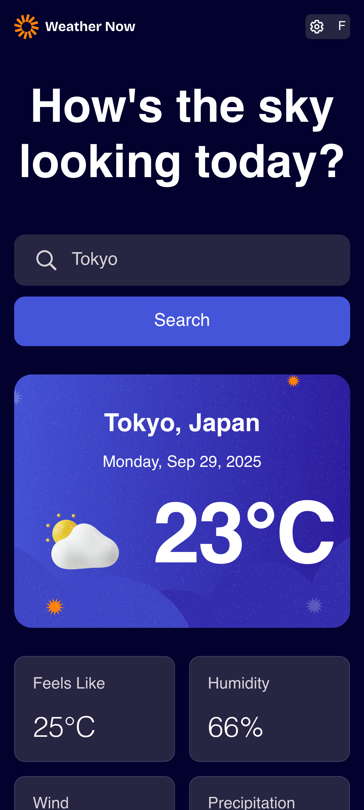
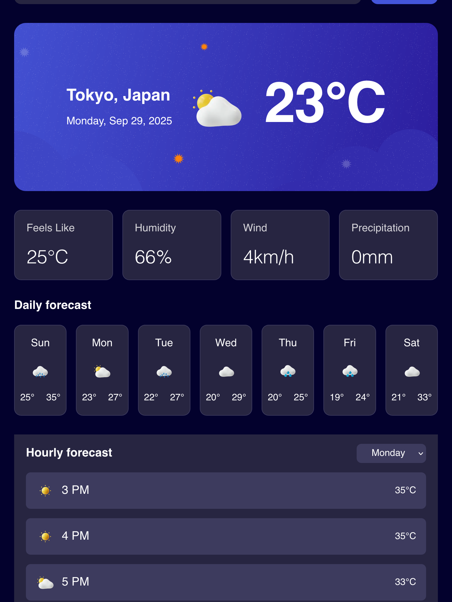

# Frontend Mentor - Weather app solution

This is a solution to the [Weather app challenge on Frontend Mentor](https://www.frontendmentor.io/challenges/weather-app-K1FhddVm49). Frontend Mentor challenges help you improve your coding skills by building realistic projects. 

## Table of contents

- [Frontend Mentor - Weather app solution](#frontend-mentor---weather-app-solution)
  - [Table of contents](#table-of-contents)
  - [Overview](#overview)
    - [The challenge](#the-challenge)
    - [Screenshot](#screenshot)
    - [Links](#links)
  - [My process](#my-process)
    - [Built with](#built-with)
    - [What I learned](#what-i-learned)
    - [Continued development](#continued-development)
    - [Useful resources](#useful-resources)
  - [Author](#author)
  - [Acknowledgments](#acknowledgments)

## Overview

### The challenge

Users should be able to:

- Search for weather information by entering a location in the search bar
- View current weather conditions including temperature, weather icon, and location details
- See additional weather metrics like "feels like" temperature, humidity percentage, wind speed, and precipitation amounts
- Browse a 7-day weather forecast with daily high/low temperatures and weather icons
- View an hourly forecast showing temperature changes throughout the day
- Switch between different days of the week using the day selector in the hourly forecast section
- Toggle between Imperial and Metric measurement units via the units dropdown 
- Switch between specific temperature units (Celsius and Fahrenheit) and measurement units for wind speed (km/h and mph) and precipitation (millimeters) via the units dropdown
- View the optimal layout for the interface depending on their device's screen size
- See hover and focus states for all interactive elements on the page

### Screenshot




### Links

- Solution URL: [Add solution URL here](https://your-solution-url.com)
- Live Site URL: [Add live site URL here](https://your-live-site-url.com)

## My process

### Built with

- Semantic HTML5 markup
- Flexbox
- CSS Grid
- Mobile-first workflow
- [React](https://reactjs.org/) - JS library
- [Styled Components](https://styled-components.com/) - For styles


### What I learned
```css
 display: flex;
  flex-direction: column;
  justify-content: center;
  align-items: center;
  gap: 1rem;
  background-image: url(${(props) => props.mobile});
  background-size: cover;
  background-repeat: no-repeat;
  background-position: center;
  border-radius: 1.25rem;
  width: 100%;
  height: 17.875rem;
```
```js
const { data, error, isLoading } = useSWR(
    shouldFetchData
      ? `https://geocoding-api.open-meteo.com/v1/search?name=${encodeURIComponent(
          submittedSearchText ?? ""
        )}&count=1`
      : null,
    fetcher
  );
```

### Continued development
- Error Handling
- React Styled Component
- Hover State 


### Useful resources

- [Using styled-components in TypeScript: A tutorial with examples](https://blog.logrocket.com/using-styled-components-in-typescript-a-tutorial-with-examples/) - This blog article explains how to implement styled component with Typescript.
- [SWR](https://swr.vercel.app/) - This is a react hooks library for data fetching. It is a great tool for fetching data and simplifying the logic in your code. Give it a try in your next project.

## Author

- Frontend Mentor - [@mayor-creator](https://www.frontendmentor.io/profile/mayor-creator)
- Threads - [@mayor_creator](https://www.threads.com/@mayor_creator)

## Acknowledgments


